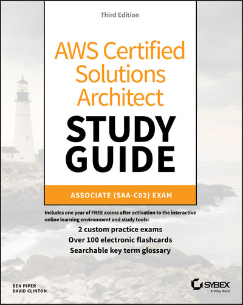

# AWS Solutions Architecture Certification

## Re-certification

I certified in 2019, have to re-certify in 2022.

That is at least 3 reInvent's..

*Things have changed*

## What I've used

 * [O'Reilly  - AWS Certified Solution Architect video series](https://learning.oreilly.com/videos/aws-certified-solutions/9780136721246/)
 * [O'Reilly - AWS Certifed Solution architect offical study guide](https://learning.oreilly.com/library/view/aws-certified-solutions/9781119713081/)
 * [Udemy Solution architecture certification Exam Questions]()
 * Pearson Exam study guide

## Exam Structure

 * Domain 1: Design Resilient Architectures - 30%
 * Domain 2: Design High‐Performing Architectures - 28%
 * Domain 3: Design Secure Applications and Architectures - 24%
 * Design Cost‐Optimized Architectures - 18%

## Part 1 - Core AWS Services

### Chapter 1 - Introduction to Cloud Computing and AWS
### Chapter 2 - Amazon Elastic Compute Cloud and Amazon Elastic Block Store
### Chapter 3 - AWS Storage
### Chapter 4 - AWS Virtual Private Cloud
### Chapter 5 - Database Services
### Chapter 6 - Authentication and Authorization
### Chapter 7 - Cloudtrail, Cloudwatch , AWS Config
### Chapter 8 - The Domain Name System and Network Routing: Amazon Route 53 and Amazon CloudFront
### Chapter 9 - Simple Queue Service and Kinesis

## Part 2 - Well Architected Framework

### Chapter 10 - Reliabiltiy Pillar
### Chapter 11 - Performance Efficiecy Pillar
### Chapter 12 - Security Pillar
### Chapter 13 - Cost Optimization Pillar
### Chapter 14 - Operational Excellence Pillar

## Practice Exams

### Practice exam 1

Cost Optimized architectures (50%)
High Performing Architectues (52%)
Resilient Architectures (69%)
Secure Architectures (71%)

#### Brush up areas:

AWS Guard duty / Inspector

**EC2 Compute**
EC2 + File storage options
EC2 Placement group types / tradeoffs
AutoScaling groups - policy configuration options for scaling and state

**Storage**
S3 Storage tiering transfers / lifecycle policies, FsX new products
EFS configuration options 
Limits on Snowball techs, AWS Storage gateway
S3 Transfer acceleratino / multipart upload 
Storage relative costs
Storage retention rules, exceptions

**Scaling / Security products**
SQS - Limits, Batch modes
AWS WAF Features, rule policies
AWS Global accelerator
Lambda language options / support, limits on concurrency
Kinesis -- Firehose, data streams choice

## Storage Questions

Ways differ from block / object storage?

4 Data/meta-Data
5 Stored in buckets

Inappropriate use cases
2 - FS mount
4 - primary db Storage

Key characteristics
1 all objects url
2 unlimited amounts data
3 s3 uses rest API

Restrict access
2. Pre-signed url
3. S3 ACL
5. S3 bucket policy

Accidental deletion
1 MFA Delete
3 Versioning

Storing to reduce cost
3. S3 Infrequent access after 30 days

How is data stored in S3 for high durability?
2. Replicated within a region

URL https://bucket1.abc.com.s3.amazonaws.com/folderx/myfile.doc

3. The object 'folderx/myfile.doc' is stored in bucket bucket1.abc.com

https://{bucket-name}.s3.amazonaws.com/{object_path}

Record of who accessed, from where?
3. Server access logs on the bucket1

Why cross region replication?

2. Lower latency
3. Compliance reasons - Data

11. Encrypted before being sent?

3. Client side encryption

Web app from s3 - performance, scalability of S3?

2. hash prefix to key names

What needed before cross-region?

Versioning
IAM policy to replicate objects

100 TB of financials?
2. S3 with glacier after 1 year

s3 Bucket policies? 3 criteria

IP Address range (CIDR)
prefix
AWS account

Eventual consistency - stale Data
GET/LIST after Delete
GET after overwrite PUT

TO host static website in S3?
Configure for static hosting, index error
bucket same name as website
objects world readable

Valuable media files?
Pre-signed URL's  (or ASW IAM?)

Glacier used for?
Infrequently accessed
Available 3-5 hours

Glacier statements?
Stores data in archives contained in vaults
Archives 3-5 hours to restore
Vaults  can be locked
